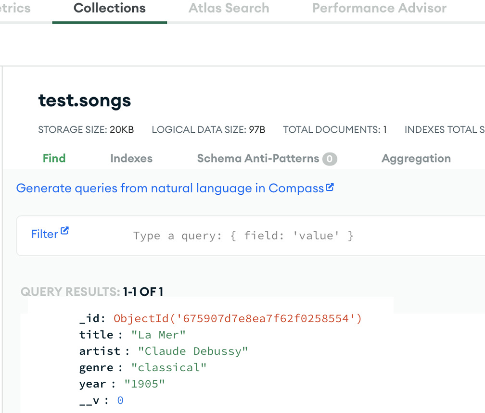

## **Express-Mongodb-Advanced**

## **Objective**
- Review basic CRUD operations using Mongoose.
- Perform more complex queries and updates.
- Learn to handle validation and errors more effectively.

## **Instructions**
## Part 1: Set Up the Project
- Initialize the Project and Install Dependencies:

- [x] mkdir express-mongodb-advanced
- [x] cd express-mongodb-advanced
- [x] npm init -y
- [x] npm install express mongoose dotenv
## **Create the Server:**
- Create a file named index.js and set up a basic Express server with Mongoose connection. Put the connection string into the .env file. You may use the same connection string as before.
## **Part 2: Define the Schema and Model**
- [x] Create models/songs.js:
- [x] Define a user schema with the following fields: title, artist, genre.

## **Part 3: Create and Read Users**
- [x] Update index.js to include routes for creating and reading users:
- [x] Route to add a new user (POST /songs).

## **Part 4: Test Create and Read Operations**
- Start Your Server:
- npm run dev
- Test with Thunder Client or Postman:

## **web.postman.co** 

## **cloud.mongodb.com** 

